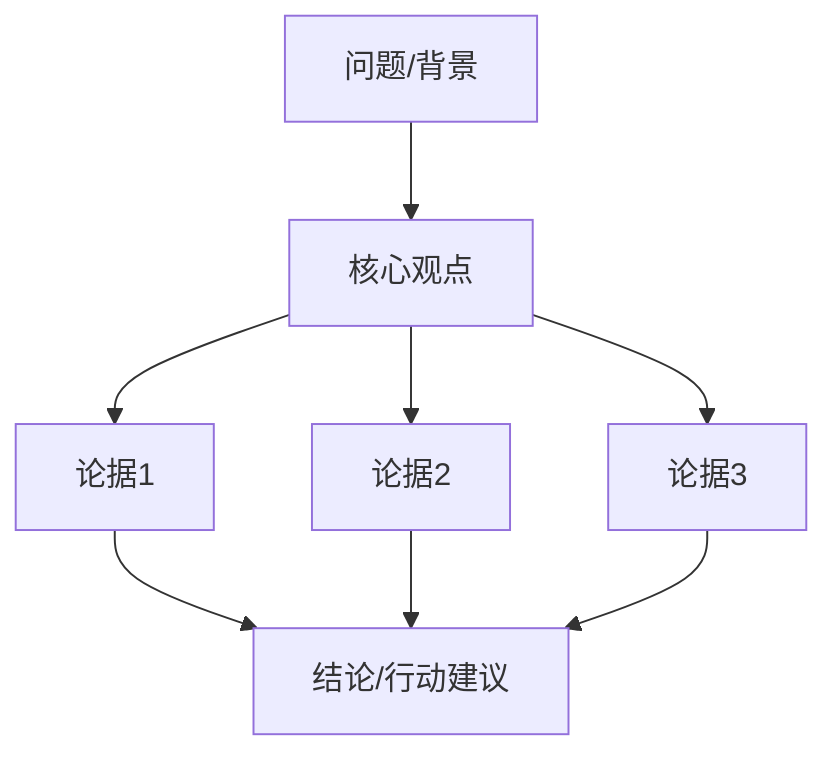
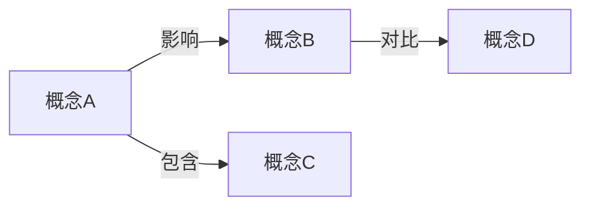
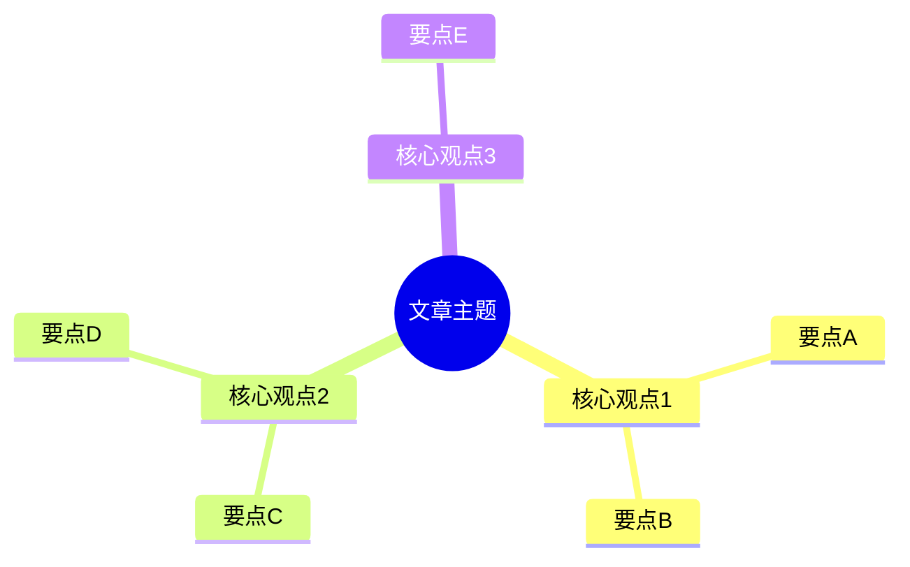

# 📚 WeChat Article Learner — 公众号文章知识点总结学习 Skill

> 将公众号文章转化为结构化的知识笔记。
> 提炼核心观点、梳理逻辑链条、生成可复习的学习材料。

---

## 触发条件

**关键词触发**：
- `总结文章` / `分析文章` / `文章总结` / `知识提炼`
- `公众号文章` / `学习笔记` / `读后笔记`
- `帮我分析这篇文章` / `提炼知识点`
- `article summary` / `knowledge extraction`

**场景触发**：
- 用户粘贴了一篇公众号文章的内容，要求总结
- 用户提供了文章链接或文件路径，要求分析
- 用户说"帮我看看这篇文章讲了什么"
- 用户说"把这篇文章的知识点整理一下"
- 用户提供多篇文章，要求对比分析或主题汇总

---

## 输入输出规范

### 输入
| 参数 | 类型 | 必填 | 说明 |
|------|------|------|------|
| 文章内容 | 文本/文件路径 | ✅ | 公众号文章的正文内容，支持直接粘贴或提供文件路径 |
| 分析深度 | 枚举 | ❌ | `快速摘要` / `标准分析` / `深度拆解`，默认为 `标准分析` |
| 输出格式 | 枚举 | ❌ | `学习笔记` / `知识卡片` / `思维导图` / `全部`，默认为 `学习笔记` |
| 关注领域 | 文本 | ❌ | 用户特别关注的方向，如"产品设计"、"技术架构"等 |

### 输出
| 产物 | 说明 |
|------|------|
| 文章元信息 | 标题、作者、主题领域、文章类型 |
| 核心摘要 | 一段话概括文章核心观点（≤100字） |
| 知识点清单 | 结构化的关键知识点列表 |
| 逻辑脉络图 | 文章论证的逻辑链条（Mermaid 格式） |
| 金句摘录 | 值得记忆的精华句子 |
| 学习笔记 | 完整的结构化学习笔记 |
| 行动建议 | 基于文章内容的可执行行动项 |

---

## 执行流程

### Phase 1：内容获取与预处理

#### 1.1 获取文章内容

**方式 A：用户直接粘贴**
用户在对话中直接粘贴文章内容 → 提取正文

**方式 B：文件路径**
用户提供文件路径 → 读取文件内容
```
支持格式：.md / .txt / .html
如果是 HTML，提取 <article> 或 <div class="rich_media_content"> 中的正文
```

**方式 C：多篇文章**
用户提供多篇文章 → 逐篇分析后进行对比汇总

#### 1.2 内容清洗
- 去除广告、推广、关注引导等非正文内容
- 去除重复的分隔线和装饰性 emoji
- 保留有意义的结构标记（标题层级、列表、引用）
- 识别并标记图片描述（如有）

#### 1.3 文章元信息识别
```
📋 文章信息
- 标题：{从内容中识别}
- 作者/来源：{从内容中识别，未知则标注}
- 主题领域：{自动分类，如：产品设计/技术架构/商业分析/个人成长/行业洞察}
- 文章类型：{观点论述/案例分析/方法论/知识科普/经验分享/行业报告}
- 预估阅读时间：{基于字数估算}
- 内容质量预判：{信息密度高/中/低}
```

---

### Phase 2：深度分析

#### 2.1 核心论点提取

识别文章的**中心论点**和**支撑论据**：

```
🎯 核心论点
{一句话概括文章最核心的观点}

📌 支撑论据
1. {论据1} — {简要说明}
2. {论据2} — {简要说明}
3. {论据3} — {简要说明}
```

#### 2.2 知识点拆解

将文章内容拆解为独立的知识点，每个知识点包含：

```
💡 知识点 #{序号}：{知识点标题}
- 核心概念：{一句话解释}
- 详细说明：{2-3句展开}
- 关键数据/案例：{文中提到的数据或案例}
- 适用场景：{这个知识点在什么场景下有用}
- 关联知识：{与其他已知概念的关联}
```

#### 2.3 逻辑脉络梳理

用 Mermaid 流程图展示文章的论证逻辑：



根据文章实际结构调整图的形式：
- **线性论证** → 用流程图（graph TD）
- **对比分析** → 用左右对比结构
- **层级递进** → 用树状结构
- **循环模型** → 用环形图

#### 2.4 概念关系图（深度拆解模式）

如果用户选择深度拆解，额外生成概念关系图：



---

### Phase 3：知识提炼

#### 3.1 金句摘录

提取文章中最有价值的原文句子（3-5句）：

```
✨ 金句摘录

1. "{原文金句1}"
   → 我的理解：{用自己的话解读}

2. "{原文金句2}"
   → 我的理解：{用自己的话解读}

3. "{原文金句3}"
   → 我的理解：{用自己的话解读}
```

**金句筛选标准**：
- 高度概括了某个重要观点
- 提供了独特的视角或洞察
- 包含可直接引用的精炼表达
- 具有启发性，能引发进一步思考

#### 3.2 方法论/框架提取

如果文章包含方法论或思维框架，单独提炼：

```
🔧 方法论/框架

框架名称：{名称}
适用场景：{什么时候用}
核心步骤：
  Step 1：{步骤描述}
  Step 2：{步骤描述}
  Step 3：{步骤描述}
使用示例：{简要举例}
```

#### 3.3 批判性思考

对文章观点进行客观评价：

```
🤔 批判性思考

✅ 文章的优势：
- {优势1}
- {优势2}

⚠️ 需要注意的局限：
- {局限1：如样本偏差、时效性、适用范围等}
- {局限2}

❓ 值得进一步探索的问题：
- {延伸问题1}
- {延伸问题2}
```

---

### Phase 4：输出生成

根据用户选择的输出格式，生成对应的学习材料。

#### 4.1 学习笔记格式（默认）

```
═══════════════════════════════════════
📚 学习笔记：{文章标题}
═══════════════════════════════════════

## 📋 文章信息
{Phase 1.3 的元信息}

## 🎯 一句话总结
{≤100字的核心摘要}

## 💡 核心知识点
{Phase 2.2 的知识点清单}

## 🔗 逻辑脉络
{Phase 2.3 的 Mermaid 图}

## ✨ 金句摘录
{Phase 3.1 的金句}

## 🔧 方法论/框架
{Phase 3.2 的框架，如有}

## 🤔 批判性思考
{Phase 3.3 的思考}

## ✅ 行动建议
基于这篇文章，建议你：
1. {具体可执行的行动1}
2. {具体可执行的行动2}
3. {具体可执行的行动3}

## 🔖 关联阅读
- {推荐的相关主题或概念，方便进一步学习}

═══════════════════════════════════════
```

#### 4.2 知识卡片格式

生成简洁的知识卡片，适合快速复习：

```
┌─────────────────────────────────┐
│ 📇 知识卡片 #1                  │
│                                 │
│ Q: {问题形式的知识点}            │
│ A: {简洁的回答}                  │
│                                 │
│ 💡 记忆锚点：{帮助记忆的关键词}   │
│ 📎 来源：{文章标题}              │
└─────────────────────────────────┘
```

每篇文章生成 3-8 张知识卡片，覆盖核心知识点。

#### 4.3 思维导图格式

生成 Mermaid mindmap 格式的思维导图：



---

### Phase 5：多篇文章对比（可选）

当用户提供多篇文章时，在逐篇分析后额外生成对比分析：

```
═══════════════════════════════════════
📊 多篇文章对比分析
═══════════════════════════════════════

## 主题关联
{这几篇文章围绕什么共同主题}

## 观点对比
| 维度 | 文章A | 文章B | 文章C |
|------|-------|-------|-------|
| 核心观点 | ... | ... | ... |
| 方法论 | ... | ... | ... |
| 适用场景 | ... | ... | ... |

## 共识与分歧
✅ 共识：{多篇文章一致认同的观点}
⚡ 分歧：{文章间观点不同的地方}

## 综合洞察
{基于多篇文章的综合分析，提炼更高层次的认知}

═══════════════════════════════════════
```

---

## 分析深度说明

### 快速摘要模式
- 仅输出：核心摘要 + 3-5个关键知识点 + 行动建议
- 适合：时间紧张，只需快速了解文章大意
- 预计输出：300-500字

### 标准分析模式（默认）
- 输出：完整学习笔记（Phase 1-4 全流程）
- 适合：日常学习，需要系统理解文章内容
- 预计输出：800-1500字

### 深度拆解模式
- 输出：标准分析 + 概念关系图 + 扩展的批判性思考 + 与已有知识体系的关联
- 适合：重要文章，需要深入理解并纳入知识体系
- 预计输出：1500-2500字

---

## 质量标准

一份好的知识总结应该满足：

1. **准确性**：忠实反映原文观点，不歪曲、不过度解读
2. **结构性**：层次清晰，逻辑连贯，便于回顾
3. **精炼性**：去除冗余，保留精华，信息密度高于原文
4. **可操作性**：包含具体的行动建议，不只是"了解了"
5. **批判性**：不盲目接受，指出局限和值得质疑的地方
6. **关联性**：将新知识与已有认知框架建立连接

---

## AI 分析指引

在分析文章时，注意以下要点：

- **区分事实与观点**：标注哪些是客观事实/数据，哪些是作者的主观判断
- **识别论证质量**：注意是否有逻辑跳跃、以偏概全、幸存者偏差等问题
- **关注信息时效**：标注文章中的数据和案例是否可能已过时
- **提炼可迁移知识**：优先提取能在其他场景复用的方法论和思维模型
- **保持中立立场**：即使文章观点鲜明，总结时也要保持客观
- **适配用户关注领域**：如果用户指定了关注方向，在分析时侧重该方向的内容
